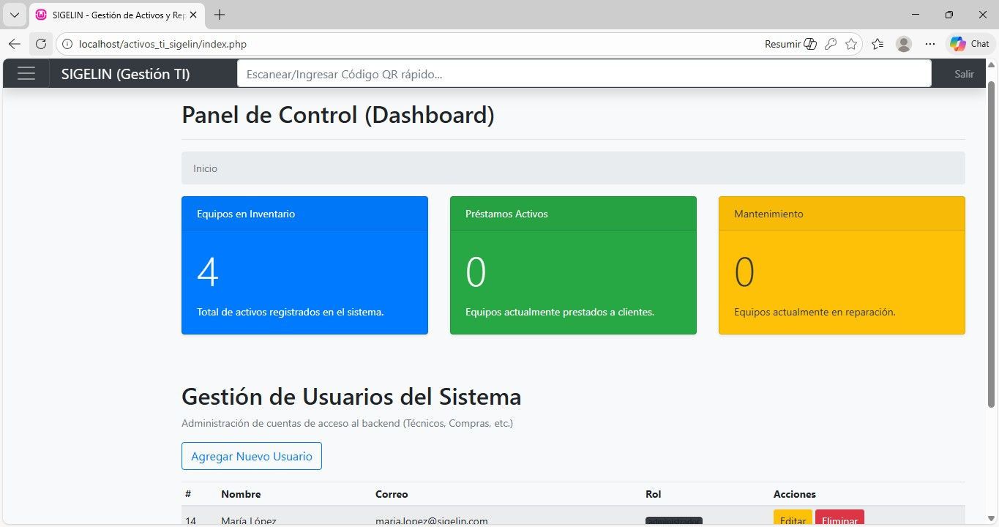
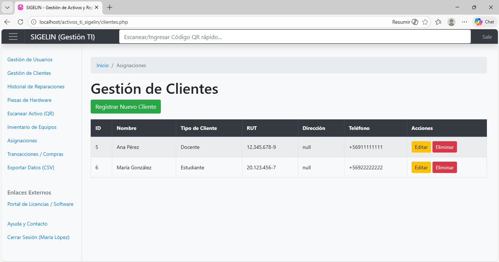

# Sistema de Gestión [Nombre] (PHP Fullstack) 💻🌐

Plataforma web integral para la administración de [Mencionar objetivo, ej: pacientes y citas]. Desarrollada con arquitectura nativa sin frameworks pesados para demostrar dominio de la lógica de programación.

### 📺 Demo del Proyecto
¡Haz clic en la pantalla para ver el flujo completo del sistema!

[

---

### 📸 Capturas de Pantalla

| Dashboard Principal | Formulario de Registro |
| :---: | :---: |
|  |  |
*(El diseño cuenta con interfaz amigable y validaciones en tiempo real)*

---

### 🚀 Stack Tecnológico
* **Backend:** PHP 8 (Programación Estructurada/POO).
* **Base de Datos:** MySQL (Relacional).
* **Frontend:** HTML5, CSS3, JavaScript, Bootstrap (si usaste).
* **Servidor Local:** WAMP / XAMPP.

### ⚙️ Instalación
1. Clona este repositorio.
2. Importa el archivo `/sql/base_de_datos.sql` en tu phpMyAdmin.
3. Configura el archivo `conexion.php` con tus credenciales locales.
4. Abre `localhost/nombre-proyecto` en tu navegador.

---
**Autor:** [Tu Nombre]
